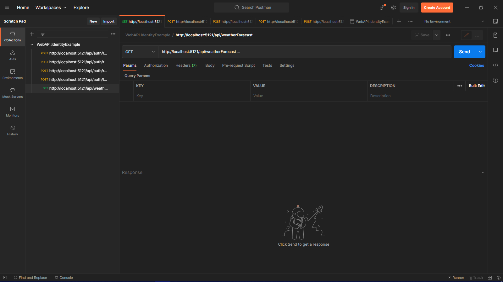

# WebAPI.IdentityExample

This repository contains simple use-case for ASP.Net Core Identity with roles.

- [X] Implement basic identity
- [ ] ~~Use password hashing and salting~~ (Default `PasswordHasher` is used)

## Postman

Use [`WebAPI.IdentityExample.postman_collection.json`](./WebAPI.IdentityExample.postman_collection.json) to test the API in Postman.

